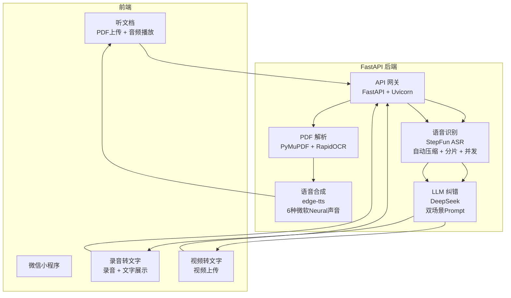

# English Audio Notes — 多模态语音智能处理平台

基于微信小程序 + Python FastAPI 的端到端语音 AI 应用，集成 **语音合成 (TTS)**、**语音识别 (ASR)**、**大语言模型纠错 (LLM)**，支持 PDF 文档 → 音频 → 文本的全链路转换。

[](https://www.python.org/)
[](https://fastapi.tiangolo.com/)

---

## 架构



---

## 功能

### 📖 听文档
- 上传 PDF → 自动提取文字 → TTS 语音朗读
- 支持**扫描件 PDF**（RapidOCR 识别 + LLM 纠错）
- **6 种声音**可选（中/英 × 男/女 × 美式/英式）
- **0.5x – 2x 倍速**调节
- 连续播放（自动播放下一段）
- 上传进度条 + 播放进度条（可拖动）

### 🎙️ 录音 / 视频转文字
- 录音转文字（录音 / 暂停 / 继续 / 停止）
- **视频上传自动提取音频**（MP4/MOV/AVI/MKV 等）
- 自动检测中英文
- **ASR → LLM 纠错 pipeline**（同音词纠正 + 标点补全）
- 历史记录（最近 100 条）

---

## 核心技术 Pipeline

### ASR 纠错链路

```
音频/视频上传
    │
    ▼
┌──────────────────────────────────────┐
│ 1. 视频检测 → 自动提取音频 (FFmpeg)    │
│ 2. 大文件压缩 (MP3 16kHz mono 32kbps) │
│ 3. 长音频分片 (10分钟/片)              │
│ 4. 6线程并发 ASR (StepFun)            │
│ 5. 分片结果合并 → DeepSeek 纠错        │
└──────────────────────────────────────┘
    │
    ▼
  纠错后文本
```

### 纠错效果对比

| 场景 | 原始输出 | DeepSeek 纠错后 |
|------|---------|----------------|
| 同音词 | "correlate with sth 与..相关" | "correlate with sth 与…相互关联" |
| 拼写错误 | "victoru 胜利 triumph/u" | "triumph/victory 胜利" |
| OCR 乱码 | "spur to s t h 对..的激励" | "spur to sth 对…的激励" |

---

## 技术栈

| 模块 | 技术 | 选型理由 |
|------|------|----------|
| 前端 | 微信小程序原生 | 无需安装，微信生态 |
| 后端框架 | Python FastAPI | 异步支持好，与个人技术栈统一 |
| PDF 文本提取 | **PyMuPDF** | 对文字型 PDF 提取质量最高 |
| PDF 扫描件 OCR | **RapidOCR** | 离线可用，中文识别率好 |
| 语音合成 (TTS) | **edge-tts** | 免费使用微软 Neural 声音，6 种音色 |
| 语音识别 (ASR) | **StepFun stepaudio-2.5-ASR** | 中英双语，识别准确率高 |
| 大语言模型 | **DeepSeek Chat** | 性价比高，纠错 Prompt 效果好 |
| 音频处理 | **FFmpeg** (imageio-ffmpeg) | 压缩、分片、视频提取 |
| 并发处理 | `ThreadPoolExecutor` (6 workers) | 长音频分片并发识别 |
| 容器化 | Docker | 一键部署，环境一致 |

---

## API 接口

### `POST /upload` — 上传 PDF 生成音频

```bash
curl -X POST http://localhost:8000/upload \
  -F "file=@document.pdf" \
  -F "voice_id=en-us-female" \
  -F "rate=120" \
  -F "pages=1-5"
```

响应：
```json
{
  "id": "a1b2c3d4",
  "segments": [
    {
      "index": 0,
      "text": "Chapter 1: Introduction...",
      "audio": "/audio/a1b2c3d4_0.mp3"
    }
  ]
}
```

### `POST /transcribe` — 语音 / 视频转文字

```bash
curl -X POST http://localhost:8000/transcribe \
  -F "file=@lecture.mp4" \
  -F "language=auto"
```

响应：
```json
{
  "id": "e5f6g7h8",
  "text": "Today we're going to discuss the correlation between...",
  "language": "auto"
}
```

### `POST /tts` — 文本转语音

```bash
curl -X POST http://localhost:8000/tts \
  -F "text=Hello, this is a test." \
  -F "language=en" \
  -F "voice_id=en-gb-female" \
  -F "rate=100"
```

### `GET /voices` — 获取可用声音列表

### `GET /languages` — 获取支持语言

---

## 快速开始

```bash
# 1. 克隆
git clone https://github.com/songjialei-s/english-audio-notes.git
cd english-audio-notes

# 2. 配置 API Key
cp .env.example .env
# 编辑 .env 填入你的 StepFun / DeepSeek / 火山引擎 API Key

# 3. 安装依赖
pip install -r requirements.txt

# 4. 启动后端
python -m uvicorn backend.main:app --host 0.0.0.0 --port 8000

# 5. 小程序
# 微信开发者工具导入 miniprogram/ 目录
```

### Docker 部署
```bash
docker build -t english-audio-notes .
docker run -p 8000:8000 --env-file .env english-audio-notes
```

---

## 项目结构

```
english-audio-notes/
├── backend/
│   ├── main.py             # FastAPI 入口 (8 个接口)
│   ├── pdf_module.py       # PDF 提取 (PyMuPDF + RapidOCR + LLM 纠错)
│   ├── pdf_parser.py       # 文字分段处理
│   ├── tts.py              # edge-tts 语音合成 (6 种声音 + 倍速)
│   ├── stt.py              # StepFun ASR + 分片 + 并发 + DeepSeek 纠错
│   ├── volcano_llm.py      # DeepSeek LLM 纠错 (Prompt 工程)
│   ├── volcano_ocr.py      # 火山引擎 OCR (Vision LLM)
│   └── text_corrector.py   # 本地纠错 (备用)
├── miniprogram/
│   ├── pages/index/        # 听文档页
│   ├── pages/player/       # 播放器页
│   ├── pages/record/       # 录音转文字页
│   └── utils/api.js        # API 封装
├── tests/                  # 测试文件
├── Dockerfile
├── .env.example
├── requirements.txt
└── README.md
```

---

## 技术决策记录

| 决策 | 方案 | 理由 |
|------|------|------|
| TTS 引擎 | edge-tts vs pyttsx3 | edge-tts 免费调用微软 Neural 声音，音质远好于本地 SAPI5 |
| ASR 方案 | StepFun vs 腾讯/阿里 ASR | StepFun 中英双语模型识别率高，API 简洁 |
| OCR 方案 | RapidOCR + LLM vs 纯 OCR | 扫描件手写英文识别率低，加 LLM 后可纠正拼写和还原词组 |
| 纠错策略 | 双 Prompt 分场景 | OCR 纠错 (词组还原) 和 ASR 纠错 (同音词) 需要不同的 Prompt 策略 |
| 音频处理 | FFmpeg 压缩分片 | > 7.5MB 音频压缩为 MP3 16kHz，长音频 10 分钟/片，6 线程并发 |
| 并发模型 | ThreadPoolExecutor | ASR API 是 IO 密集型，多线程足够，不需要异步 |

---

## 版本历史

- **v1.6** — edge-tts 替换 pyttsx3，标点过滤，连续播放，/voices 接口
- **v1.5** — 上传进度条，音频进度条（可拖动），文字选择复制
- **v1.4** — StepFun ASR 替换 Whisper，DeepSeek 纠错，音频压缩分片并发
- **v1.3** — DeepSeek LLM 纠错模块（OCR 场景）
- **v1.2** — RapidOCR 扫描件 PDF 支持
- **v1.1** — 录音转文字功能
- **v1.0** — PDF 提取 + TTS + 基础播放器
